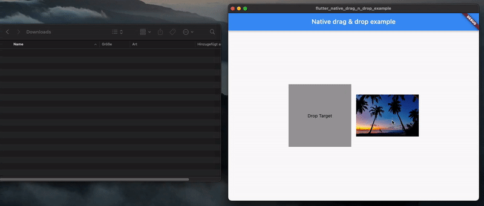

# flutter_native_drag_n_drop

A flutter plugin to support the native drag and drop, especially to drag files (only files) out of the application boundary.



###

|  Supported Platforms |            |
|---------|------------|
| Windows | ❌          |
| macOS   | ✅          |

## To-do's (future versions)
- Better drag image handling (remove native implementation, drag image should be set on dart side)
- Windows implementation

## Usage

1. To use this plugin, add `flutter_native_drag_n_drop` as a dependency in your pubspec.yaml file.

1. Use the `NativeDraggable` widget and pass `NativeDragItem` objects for drag & drop within the application and `NativeDragFileItem` objects for support drag & drop across applications. Passing a mix of both are not allowed. When you drop the objects within the application, you have to use the `data` object from the items. Otherwise you pass an `fileStreamCallback` function and return a stream which will writes the binary data outside of the application into a file.

### NativeDragItem vs. NativeDragFileItem

`NativeDragItem` is used for when you just drag and drop within the application (e.g folder, image).
```
NativeDragItem<T extends Object>(
    required String name,
    T? data
)
```

`NativeDragFileItem` is used for files, especially when you want to support the drag and drop outside of the application (e.g file to Finder or Mail client).
```
NativeDragFileItem<T extends Object> extends NativeDragItem(
    required String fileName,
    required int fileSize
)
```

```dart
NativeDraggable(
    child: Container(),
    // use items OR fileItems. Not both!
    items: [NativeDragItem(name: "helloWorld.jpeg", data: helloWorldImg)],
    fileItems: [NativeDragFileItem(fileName: "helloWorld.jpeg", fileSize: 1024, data: helloWorldImg)],
    fileStreamCallback: (item, fileName, url, progressController) async* {
        // item is the desired 'NativeDragFileItem' object, fileItem the name of the file, url the location where the user dropped the item, progressController an object where you have to pass the current progress of the fileStream in bytes. The system use the progress to update the progress indicator in Finder
        // must return a Stream<Uint8List> object and must write file data into it
    },
    onDragStarted: (event) {
        // callback when drag has started
    },
    onDragUpdate: (event) {
        // callback when drag has moved
    },
    onDragEnd: (event) {
        // callback when drag has ended
    },
)
```

3. Use the `NativeDropTarget` to receive drop events within the application.

```dart
NativeDropTarget(
    builder: (context, candidateData, rejectedData) {
        return Container();
    },
    onDragEntered: (details) {  
        // callback when drag has entered the drop area
    },
    onDragExited: (details) {
        // callback when drag has exited the drop area
    },
    onDragUpdated: (details) {
        // callback when drag has moved within the drop area
    },
    onDragDone: (details) {
        // callback when drag has dropped
    },
    onWillAccept: (details) {
        // returns a boolean if drag item should be accepted
    }
)
```

### Example

We want to support drag and drop of image files within the application and outside of the application. For this we create a `NativeDraggable` widget with `NativeDragFileItem` objects.

```dart
NativeDraggable(
    child: Container(),
    fileItems: [
                NativeDragFileItem(
                fileName: "image.jpg",
                fileSize: image.size,
                data: AssetImage("image.jpg"))
            ],
    fileStreamCallback: passFileContent,
)
```

We passed the `passFileContent` function as a fileStream callback. Inside this function we write the bytes to a stream and update the progress indicator.

```dart
Stream<Uint8List> passFileContent(
      NativeDragItem<Object> item,
      String fileName,
      String url,
      ProgressController progressController) async* {

        final response = FileService.downloadFile(
            name: "image.jpg",
            onReceive: (count, total) {
                progressController.updateProgress(count);
            }
        )

        final byteStream = response.stream:
        await for (final bytes in byteStream) {
            yield Uint8List.fromList(bytes);
        }
}
```

To receive the files within the application, we create a `NativeDropTarget` object and read the image from the `data` variable.

```dart
NativeDropTarget(
    builder: (context, candidateData, rejectedData) {
        return Container();
    },
    onDragDone: (details) {
        final image = details.items.first.data! as AssetImage;
    },
    onWillAccept: (details) {
        return true;
    }
)
```


